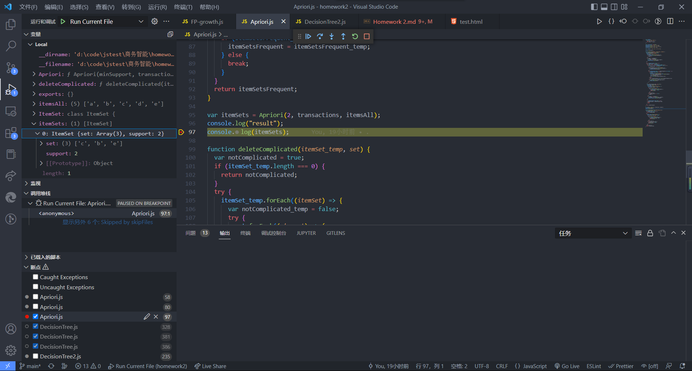
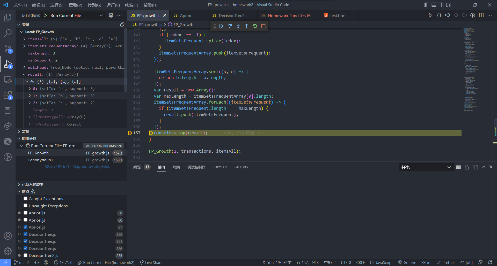

# Homework 2

He Ziang 2020302111281

## Steps of data mining

1. Data cleaning: remove the noise and inconsistent data
2. Data integration: multiple data sources may be combined
3. Data selection: data relevant to the analysis task are retrieved from database
4. Data transformation: datas are transformed and consolidated into forms appropriate for mining
5. Data mining: intelligence methods are applied to extract data patterns
6. Pattern evaluation: identify the truly interesting patterns representing knowledge based on interestingness measures
7. Knowledge presentation: visualization and knowledge representation techniques are used to present mined knowledge to users

## Apriori & FP-Growth

### Apriori

```js

class ItemSet {
  constructor(set, support) {
    this.set = set;
    this.support = support;
  }
}

const transactions = new Map();
transactions.set("1", ["a", "c", "d"]);
transactions.set("2", ["b", "c", "e"]);
transactions.set("3", ["a", "b", "c", "e"]);
transactions.set("4", ["b", "e"]);

const itemsAll = ["a", "b", "c", "d", "e"];

console.log(itemsAll);

function Apriori(minSupport, transactions, itemsAll) {
  var itemSetsFrequent = new Array();
  itemsAll.forEach((itemSingle) => {
    var support = 0;
    transactions.forEach((transaction) => {
      if (transaction.includes(itemSingle)) {
        support++;
      }
    });
    if (support >= minSupport) {
      var item = [itemSingle];
      var itemSet = new ItemSet(item, support);
      itemSetsFrequent.push(itemSet);
    }
  });

  while (itemSetsFrequent.length > 1) {
    var itemSet_temp = new Array();
    for (var i = 0; i < itemSetsFrequent.length; i++) {
      for (var j = i + 1; j < itemSetsFrequent.length; j++) {
        var setComplicated = new Array();

        itemSetsFrequent[i].set.forEach((element) => {
          if (itemSetsFrequent[j].set.includes(element)) {
            setComplicated.push(element);
          }
        });
        if (setComplicated.length === itemSetsFrequent[i].set.length - 1) {
          if (setComplicated.length !== 0) {
            var set;
            setComplicated.forEach((element) => {
              var index = itemSetsFrequent[i].set.indexOf(element);
              set = itemSetsFrequent[i].set;
              set.splice(index, 1);
              set = set.concat(itemSetsFrequent[j].set);
            });
          } else {
            set = itemSetsFrequent[i].set.concat(itemSetsFrequent[j].set);
          } //將去重后的字符串放入itemSet_temp中待剪枝
          if (deleteComplicated(itemSet_temp, set)) {
            itemSet_temp.push(set);
          }
        }
      }
    }
    var itemSetsFrequent_temp = new Array();
    itemSet_temp.forEach((item) => {
      var support = 0;
      transactions.forEach((transaction) => {
        var capable_support = true;
        try {
          item.forEach((element) => {
            if (!transaction.includes(element)) {
              capable_support = false;
              throw Error();
            }
          });
        } catch (err) {}
        if (capable_support === true) {
          support++;
        }
      });
      if (support >= minSupport) {
        var itemSet = new ItemSet(item, support);
        itemSetsFrequent_temp.push(itemSet);
      }
    });

    if (itemSetsFrequent_temp.length !== 0) {
      itemSetsFrequent = itemSetsFrequent_temp;
    } else {
      break;
    }
  }
  return itemSetsFrequent;
}

var itemSets = Apriori(2, transactions, itemsAll);
console.log("result");
console.log(itemSets);

function deleteComplicated(itemSet_temp, set) {
  var notComplicated = true;
  if (itemSet_temp.length === 0) {
    return notComplicated;
  }
  try {
    itemSet_temp.forEach((itemSet) => {
      var notComplicated_temp = false;
      try {
        set.forEach((element) => {
          if (!itemSet.includes(element)) {
            notComplicated_temp = true;
            throw Error();
          }
        });
      } catch (err) {}
      if (!notComplicated_temp) {
        notComplicated = false;
        throw Error();
      }
    });
  } catch (err) {}
  return notComplicated;
}

```



### FP-Growth

```js
const transactions = new Map();
transactions.set("1", ["a", "c", "d"]);
transactions.set("2", ["b", "c", "e"]);
transactions.set("3", ["a", "b", "c", "e"]);
transactions.set("4", ["b", "e"]);

const itemsAll = ["a", "b", "c", "d", "e"];

class Tree_Node {
  constructor(setId, parentNode, support) {
    this.setId = setId;
    this.parentNode = parentNode;
    this.support = support;
    this.childNodes = new Array();
    this.sameSetNode = null;
  }
}

class SingleSetInfo {
  constructor(setId, support) {
    this.setId = setId;
    this.support = support;
    this.sameSetNode = null;
  }
}

function FP_Growth(minSupport, transactions, itemsAll) {
  var singleSetInfoArray = new Array();
  itemsAll.forEach((itemSingle) => {
    var support = 0;
    transactions.forEach((transaction) => {
      if (transaction.includes(itemSingle)) {
        support++;
      }
    });
    if (support >= minSupport) {
      var itemInfo = new SingleSetInfo(itemSingle, support);
      singleSetInfoArray.push(itemInfo);
      singleSetInfoArray.sort((a, b) => {
        return b.support - a.support;
      });
    }
  });
  //对事务集中的项集按照支持度排序
  transactions.forEach((transaction) => {
    transaction.forEach((item, indexOfTrans) => {
      var index = singleSetInfoArray.findIndex((element) => {
        return element.setId === item;
      });
      if (index === -1) {
        transaction.splice(indexOfTrans, 1);
      }
    });
    transaction.sort((a, b) => {
      //   console.log(
      //     singleSetInfoArray.findIndex((element) => {
      //       return element.setId === "b";
      //     })
      //   );
      var b_index = singleSetInfoArray.findIndex((element) => {
        return element.setId === b;
      });
      var a_index = singleSetInfoArray.findIndex((element) => {
        return element.setId === a;
      });
      return a_index - b_index;
    });
  });
  //构建树
  var nullHead = new Tree_Node(null, null, null);

  transactions.forEach((transaction) => {
    var last_node = nullHead;
    transaction.forEach((item) => {
      var node = last_node.childNodes.find((element) => {
        return element.setId === item;
      });
      if (node === undefined) {
        node = new Tree_Node(item, last_node, 1);
        last_node.childNodes.push(node);
        var setInfo = singleSetInfoArray.find((element) => {
          return element.setId === node.setId;
        });
        while (setInfo.sameSetNode !== null) {
          setInfo = setInfo.sameSetNode;
        }
        setInfo.sameSetNode = node;
      } else {
        node.support++;
      }
      last_node = node;
    });
  });

  singleSetInfoArray.reverse();
  var itemSetsFrequentArray = new Array();
  singleSetInfoArray.forEach((item) => {
    var itemSetsFrequent = new Array();
    item = item.sameSetNode;
    while (item !== null) {
      var itemNode = itemSetsFrequent.find((element) => {
        return element.setId === item.setId;
      });
      if (itemNode === undefined) {
        var itemNode = {
          setId: item.setId,
          support: item.support,
        };
        itemSetsFrequent.push(itemNode);
      } else {
        itemNode.support += item.support;
      }

      var item_init = item;
      var item_init_support = item.support;
      while (item.parentNode !== nullHead) {
        var itemNode = itemSetsFrequent.find((element) => {
          return element.setId === item.parentNode.setId;
        });
        if (itemNode === undefined) {
          itemNode = {
            setId: item.parentNode.setId,
            support: item_init_support,
          };
          itemSetsFrequent.push(itemNode);
        } else {
          itemNode.support += item_init_support;
        }

        item = item.parentNode;
      }
      item = item_init.sameSetNode;
    }

    itemSetsFrequent.sort((a, b) => {
      return b.support - a.support;
    });
    var index = itemSetsFrequent.findIndex((element) => {
      return element.support < minSupport;
    });
    if (index !== -1) {
      itemSetsFrequent.splice(index);
    }
    itemSetsFrequentArray.push(itemSetsFrequent);
  });

  itemSetsFrequentArray.sort((a, b) => {
    return b.length - a.length;
  });
  var result = new Array();
  var maxLength = itemSetsFrequentArray[0].length;
  itemSetsFrequentArray.forEach((itemSetsFrequent) => {
    if (itemSetsFrequent.length === maxLength) {
      result.push(itemSetsFrequent);
    }
  });
  console.log(result);
}

FP_Growth(2, transactions, itemsAll);
```



## Decison Tree

```js
const MarrigeSituation = {
  SINGLE: "single",
  MARRIED: "married",
  DIVORCED: "divorced",
};

Object.freeze(MarrigeSituation);

class Partition {
  constructor(first) {
    this.first = first;
    this.GiniIndex = null;
  }
}

class Node {
  constructor(mark) {
    this.children = new Array();
    this.mark = mark;
  }
}
// class Data{
//     constructor(id,loanDefaulter,hasHouse,marrigeSituation,yearlyIncome){
//         this.id=id;
//         this.loanDefaulter=loanDefaulter;
//         this.hasHouse=hasHouse;
//         this.marrigeSituation=marrigeSituation;
//         this.yearlyIncome=yearlyIncome;
//     }
// }
const prototypeData = {
  id: 0,
  hasHouse: false,
  marrigeSituation: MarrigeSituation.SINGLE,
  yearlyIncome: 1,
  loanDefaulter: false,
};
function InitData() {
  const data1 = {
    id: 1,
    loanDefaulter: false,
    hasHouse: true,
    marrigeSituation: MarrigeSituation.SINGLE,
    yearlyIncome: 125,
  };
  const data2 = {
    id: 2,
    loanDefaulter: false,
    hasHouse: false,
    marrigeSituation: MarrigeSituation.MARRIED,
    yearlyIncome: 100,
  };
  const data3 = {
    id: 3,
    loanDefaulter: false,
    hasHouse: false,
    marrigeSituation: MarrigeSituation.SINGLE,
    yearlyIncome: 70,
  };
  const data4 = {
    id: 4,
    loanDefaulter: false,
    hasHouse: true,
    marrigeSituation: MarrigeSituation.MARRIED,
    yearlyIncome: 120,
  };
  const data5 = {
    id: 5,
    loanDefaulter: true,
    hasHouse: false,
    marrigeSituation: MarrigeSituation.DIVORCED,
    yearlyIncome: 95,
  };
  const data6 = {
    id: 6,
    loanDefaulter: false,
    hasHouse: false,
    marrigeSituation: MarrigeSituation.DIVORCED,
    yearlyIncome: 125,
  };
  const data7 = {
    id: 7,
    loanDefaulter: false,
    hasHouse: true,
    marrigeSituation: MarrigeSituation.DIVORCED,
    yearlyIncome: 220,
  };
  const data8 = {
    id: 8,
    loanDefaulter: true,
    hasHouse: false,
    marrigeSituation: MarrigeSituation.SINGLE,
    yearlyIncome: 85,
  };
  const data9 = {
    id: 9,
    loanDefaulter: false,
    hasHouse: false,
    marrigeSituation: MarrigeSituation.MARRIED,
    yearlyIncome: 125,
  };
  const data10 = {
    id: 10,
    loanDefaulter: true,
    hasHouse: false,
    marrigeSituation: MarrigeSituation.SINGLE,
    yearlyIncome: 90,
  };

  const DataArray = new Array();
  DataArray.push(data1);
  DataArray.push(data2);
  DataArray.push(data3);
  DataArray.push(data4);
  DataArray.push(data5);
  DataArray.push(data6);
  DataArray.push(data7);
  DataArray.push(data8);
  DataArray.push(data9);
  DataArray.push(data10);

  return DataArray;
}
const TestDataArray = InitData();
function GiniPartitionofMarrigeSituation(TestDataArrayofNode) {
  var partitions = new Array();
  for (var attribute in MarrigeSituation) {
    var partition = new Partition(attribute);
    partitions.push(partition);
  }
  var division = TestDataArrayofNode.length;
  var numIsDefaulter = 0;
  TestDataArrayofNode.forEach((data) => {
    if (data.loanDefaulter === true) {
      numIsDefaulter++;
    }
  });
  partitions.forEach((partition) => {
    var numContainFirst = 0;
    var numFirstIsDefaulter = 0;
    TestDataArrayofNode.forEach((data) => {
      if (data.MarrigeSituation === partition.first) {
        numContainFirst++;
        if (data.loanDefaulter === true) {
          numFirstIsDefaulter++;
        }
      }
    });
    var giniN1 =
      1 -
      Math.pow(numFirstIsDefaulter / numContainFirst, 2) -
      Math.pow(1 - numFirstIsDefaulter / numContainFirst, 2);
    var numOfSecond = division - numContainFirst;
    var numSecondIsDefaulter = numIsDefaulter - numFirstIsDefaulter;
    var giniN2 =
      1 -
      Math.pow(numSecondIsDefaulter / numOfSecond, 2) -
      Math.pow(1 - numSecondIsDefaulter / numOfSecond, 2);
    var gini =
      (numContainFirst / division) * giniN1 + (numOfSecond / division) * giniN2;
    partition.GiniIndex = gini;
  });

  partitions.sort((a, b) => {
    return a.GiniIndex - b.GiniIndex;
  });

  return partitions[0];
}

function GiniPartitionofYearlyIncome(TestDataArrayofNode) {
  var partitions = new Array();
  TestDataArrayofNode.sort((a, b) => {
    return b.yearlyIncome - a.yearlyIncome;
  });
  var division = TestDataArrayofNode.length;
  var numIsDefaulter = 0;
  TestDataArrayofNode.forEach((data) => {
    if (data.loanDefaulter === true) {
      numIsDefaulter++;
    }
  });
  var values = new Array();
  TestDataArrayofNode.forEach((data) => {
    values.push(data.yearlyIncome);
  });
  values.forEach((i) => {
    var partition = new Partition(i);
    var numBEFirst = 0;
    var numFirstIsDefaulter = 0;
    TestDataArrayofNode.forEach((data) => {
      if (data.yearlyIncome <= i) {
        numBEFirst++;
        if (data.loanDefaulter === true) {
          numFirstIsDefaulter++;
        }
      }
    });

    var giniN1 =
      1 -
      Math.pow(numFirstIsDefaulter / numBEFirst, 2) -
      Math.pow(1 - numFirstIsDefaulter / numBEFirst, 2);
    var numGFirst = division - numBEFirst;
    var numGFirstIsDefaulter = numIsDefaulter - numFirstIsDefaulter;
    var giniN2 =
      1 -
      Math.pow(numGFirstIsDefaulter / numGFirst, 2) -
      Math.pow(1 - numGFirstIsDefaulter / numGFirst, 2);
    var gini =
      (numBEFirst / division) * giniN1 + (numGFirst / division) * giniN2;
    partition.GiniIndex = gini;

    partitions.push(partition);
  });

  partitions.sort((a, b) => {
    return a.GiniIndex - b.GiniIndex;
  });
  return partitions[0];
}
class Attribute {
  constructor(type, value) {
    this.type = type;
    this.value = value;
  }
}
var attributes = new Array();
attributes.push(new Attribute("binary", "hasHouse"));
attributes.push(new Attribute("ordinal", "marrigeSituation"));
attributes.push(new Attribute("successive", "yearlyIncome"));
function GenerateDecisionTree(TestDataArrayofNode, className, attributes) {
  var node;
  
  if (attributes.length === 0) {
    node = new Node(JudgeMajority(TestDataArrayofNode, className));
    return node;
  }
  var attribute = attributes.shift();
  if (
    TestDataArrayofNode.every((data) => {
      data[className] === true;
    })
  ) {
    return (node = new Node(className));
  }
  if (
    TestDataArrayofNode.every((data) => {
      data[className] === false;
    })
  ) {
    return (node = new Node("Not" + className));
  }

  switch (attribute.type) {
    case "binary":
      node = new Node(attribute.value);
      var datas = new Array();
      var anotherDatas = new Array();
      TestDataArrayofNode.forEach((data) => {
        if (data[attribute.value] === true) {
          datas.push(data);
        } else {
          anotherDatas.push(data);
        }
      });
      if (anotherDatas.length === 0) {
        var child = new Node(JudgeMajority(TestDataArrayofNode, className));
        node.children.push(child);
      } else {
        var attributesForChild = attributes;
        var child = GenerateDecisionTree(
          anotherDatas,
          className,
          attributesForChild
        );
        node.children.push(child);
      }
      if (datas.length === 0) {
        var child = new Node(JudgeMajority(TestDataArrayofNode, className));
        node.children.push(child);
      } else {
        var attributesForChild = attributes;
        var child = GenerateDecisionTree(datas, className, attributesForChild);
        node.children.push(child);
      }
      break;
    case "ordinal":
      node = new Node(attribute.value);
      var datas = new Array();
      var anotherDatas = new Array();
      var partition = GiniPartitionofMarrigeSituation(TestDataArrayofNode);
      TestDataArrayofNode.forEach((data) => {
        if (data[attribute.value] === partition.first) {
          datas.push(data);
        } else {
          anotherDatas.push(data);
        }
      });
      if (anotherDatas.length === 0) {
        var child = new Node(JudgeMajority(TestDataArrayofNode, className));
        node.children.push(child);
      } else {
        var attributesForChild = attributes;
        var child = GenerateDecisionTree(
          anotherDatas,
          className,
          attributesForChild
        );
        node.children.push(child);
      }
      if (datas.length === 0) {
        var child = new Node(JudgeMajority(TestDataArrayofNode, className));
        node.children.push(child);
      } else {
        var attributesForChild = attributes;
        var child = GenerateDecisionTree(datas, className, attributesForChild);
        node.children.push(child);
      }
      break;
    case "successive":
      node = new Node(attribute.value);
      var datas = new Array();
      var anotherDatas = new Array();
      var partition = GiniPartitionofYearlyIncome(TestDataArrayofNode);
      TestDataArrayofNode.forEach((data) => {
        if (data[attribute.value] === partition.first) {
          datas.push(data);
        } else {
          anotherDatas.push(data);
        }
      });
      if (anotherDatas.length === 0) {
        var child = new Node(JudgeMajority(TestDataArrayofNode, className));
        node.children.push(child);
      } else {
        var attributesForChild = attributes;
        var child = GenerateDecisionTree(
          anotherDatas,
          className,
          attributesForChild
        );
        node.children.push(child);
      }
      if (datas.length === 0) {
        var child = new Node(JudgeMajority(TestDataArrayofNode, className));
        node.children.push(child);
      } else {
        var attributesForChild = attributes;
        var child = GenerateDecisionTree(datas, className, attributesForChild);
        node.children.push(child);
      }
      break;
    default:
      break;
  }
  return node;
}

function JudgeMajority(TestDataArrayofNode, className) {
  var num = 0;
  TestDataArrayofNode.forEach((data) => {
    if (data[className] === true) {
      num++;
    }
  });
  if (num >= TestDataArrayofNode.length / 2) {
    return className;
  } else {
    return "Not" + className;
  }
}

var node = GenerateDecisionTree(TestDataArray, "loanDefaulter", attributes);
console.log(node);

```


## Pseudo-code for Bayesian classification

1. C is the array of the conditions on the class we  want to figure out
2. D is the array of Docs
3. N=the number of docs in D
4. A is the array of attributes
5. A' is the array of different situations on each attributes
6. for each c in C
7. $N_c$= the number of the docs with condition c
8. $prior$[c]=$\frac{N_c}{N}$
9. -----for each a in A
10. ----------for each a' in a
11. ----------$N_{a'}$=the number of docs with attribute a'
12. ----------$N_{\frac{a'}{c}}$=the number of docs in those docs of condition c with attribute a'
13. ----------$P(a'|c)=\frac{N_{\frac{a'}{c}}}{N_{c}}$
14. ----------$P(a')=\frac{N_a}{N}$
15. ----------possibility[c][a']=$\frac{P(a'|c)P(c)}{P(a')}$
16. D' is the array of Docs to test
17. for each d in D
18. -----for each c in C
19. -----p[c]=1
20. -----Attrs is the attributes of d
21. ----------for each attr in Attrs
22. ---------------value is the situation of d at attr
23. ---------------p[c]*=possibility[c][value]
24. -----p[c']=max of p[c]
25. -----d belongs to c'

### How to change the calculation from a posteriori probability to an easily computed form

Through	Bayesian Theory


## The scenarios where k-means algorithm is not suitable for

1. user cannot give a suitable value of k
2. the shape of the clusters is not convex
3. the values of different clusters varies a lot
4. the set of the data has lot of  noises or outliers
